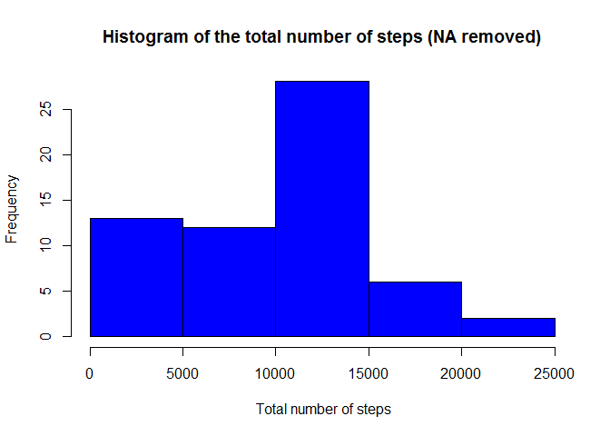
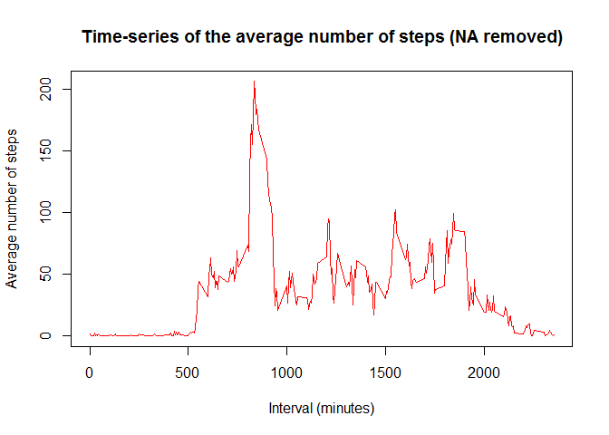
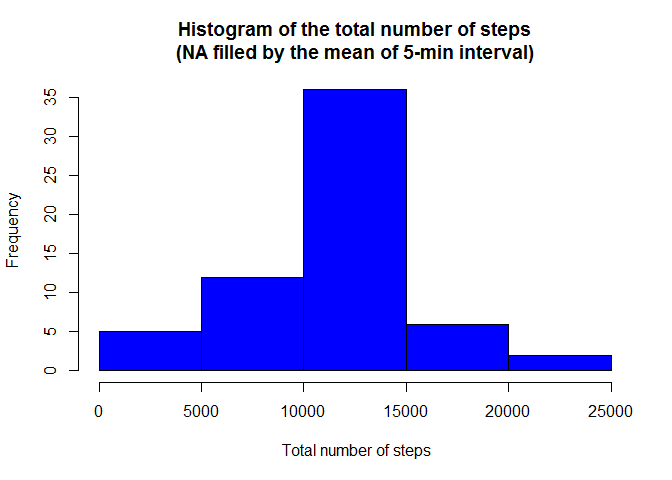
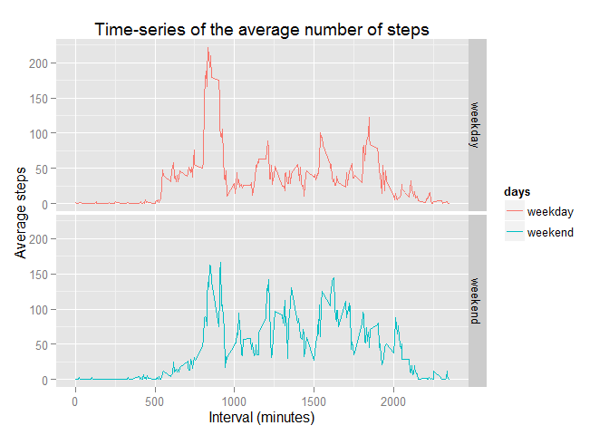

# Reproducible Research: Peer Assessment1
#### Yan Yu
#### December 10, 2015

## Introduction
This assignment makes use of data from a personal activity monitoring device. This device collects data at 5 minute intervals through out the day. The data consists of two months of data from an anonymous individual collected during the months of October and November, 2012 and include the number of steps taken in 5 minute intervals each day.

We will need to write a report that answers the questions detailed below. Ultimately, we will need to complete the entire assignment in a single R markdown document that can be processed by knitr and be transformed into an HTML file.

## Assignment
### Loading and preprocessing data

We first install packages and set the working directory.

```r
#set working directory
setwd("C:/Users/Bell/Desktop/coursera/reproducible research")
#install packages
library(ggplot2)
library(knitr)
library(dplyr)
```

```
## 
## Attaching package: 'dplyr'
## 
## The following objects are masked from 'package:stats':
## 
##     filter, lag
## 
## The following objects are masked from 'package:base':
## 
##     intersect, setdiff, setequal, union
```

Then, we load the data and process it into a format suitable for further analysis.

```r
#read data
data <- read.csv("activity.csv", na.strings = "NA")
data$date <- as.Date(data$date, "%Y-%m-%d")
```

We check names of the data and display the first six rows of the dataframe.

```r
names(data)
```

```
## [1] "steps"    "date"     "interval"
```

```r
head(data)
```

```
##   steps       date interval
## 1    NA 2012-10-01        0
## 2    NA 2012-10-01        5
## 3    NA 2012-10-01       10
## 4    NA 2012-10-01       15
## 5    NA 2012-10-01       20
## 6    NA 2012-10-01       25
```

### What is mean total number of steps taken per day?
We can ignore the missing values in the dataset for this part of the assignment.

*Calculate the total number of steps taken per day.  

```r
data2 <- with(data, tapply(steps, date, sum, na.rm = T))
head(data2)
```

```
## 2012-10-01 2012-10-02 2012-10-03 2012-10-04 2012-10-05 2012-10-06 
##          0        126      11352      12116      13294      15420
```

*Make a histogram of the total number of steps taken each day.

```r
hist(data2, col = "blue", xlab = " Total number of steps",
  main = "Histogram of the total number of steps (NA removed)")
```

 

*Calculate and report the mean of the total number of steps taken per day.

```r
mean(data2)
```

```
## [1] 9354.23
```

*Calculate and report the median of the total number of steps taken per day.

```r
median(data2)
```

```
## [1] 10395
```

### What is the average daily activity pattern?

*Make a time series plot (i.e. type = "l") of the 5-minute interval (x-axis) and the average number of steps taken, averaged across all days (y-axis).

```r
data3 <- with(data, tapply(steps, interval, mean, na.rm = T))
intervaldata <- unique(data$interval)
```

We display the first six elements.

```r
head(data3)
```

```
##         0         5        10        15        20        25 
## 1.7169811 0.3396226 0.1320755 0.1509434 0.0754717 2.0943396
```

We then plot the time series figure.

```r
plot(intervaldata, data3, type ="l", col = "red", 
     xlab ="Interval (minutes)", ylab = "Average number of steps",
     main = "Time-series of the average number of steps (NA removed)")
```

 

* Which 5-minute interval, on average across all the days in the dataset, contains the maximum number of steps?

```r
maxindex <- which(data3==max(data3))
maxinterval <- intervaldata[maxindex]
print(maxinterval)
```

```
## [1] 835
```

### Imputing missing values
Note that there are a number of days/intervals where there are missing values (coded as NA). The presence of missing days may introduce bias into some calculations or summaries of the data.

*Calculate and report the total number of missing values in the dataset (i.e. the total number of rows with NAs).

```r
nas<-sum(is.na(data))
print(nas)
```

```
## [1] 2304
```

*We plan to use the mean steps for that 5-mintue interval to fill in all of the missing values in the dataset.

  +We first calculate the mean steps for the 5-mintue interval across all days.

```r
data4 <- aggregate(data$steps, by = list(data$interval), FUN = mean, na.rm = T)
names(data4) <- c("interval", "mean")
```
  
  +We check the first six rows again

```r
head(data4)
```

```
##   interval      mean
## 1        0 1.7169811
## 2        5 0.3396226
## 3       10 0.1320755
## 4       15 0.1509434
## 5       20 0.0754717
## 6       25 2.0943396
```
  
  +Then, we merge the original data set with the new average data by interval.

```r
newdata <- merge(data, data4, by = "interval")
head(newdata)
```

```
##   interval steps       date     mean
## 1        0    NA 2012-10-01 1.716981
## 2        0     0 2012-11-23 1.716981
## 3        0     0 2012-10-28 1.716981
## 4        0     0 2012-11-06 1.716981
## 5        0     0 2012-11-24 1.716981
## 6        0     0 2012-11-15 1.716981
```
  
  +Next, we rearrange the new data by date.

```r
newdata <- arrange(newdata, date)
head(newdata)
```

```
##   interval steps       date      mean
## 1        0    NA 2012-10-01 1.7169811
## 2        5    NA 2012-10-01 0.3396226
## 3       10    NA 2012-10-01 0.1320755
## 4       15    NA 2012-10-01 0.1509434
## 5       20    NA 2012-10-01 0.0754717
## 6       25    NA 2012-10-01 2.0943396
```

*Finally, we create a new dataset that is equal to the original dataset but with the missing data filled in.

```r
naindex <- which(is.na(data))
newdata[naindex, "steps"] <- newdata[naindex, "mean"]
finaldata <- select(newdata, steps, date, interval)
head(finaldata)
```

```
##       steps       date interval
## 1 1.7169811 2012-10-01        0
## 2 0.3396226 2012-10-01        5
## 3 0.1320755 2012-10-01       10
## 4 0.1509434 2012-10-01       15
## 5 0.0754717 2012-10-01       20
## 6 2.0943396 2012-10-01       25
```

*Make a histogram of the total number of steps taken each day.

```r
data5 <- aggregate(finaldata$steps, by = list(finaldata$date), FUN = sum)
names(data5) <- c("date", "sum")
head(data5)
```

```
##         date      sum
## 1 2012-10-01 10766.19
## 2 2012-10-02   126.00
## 3 2012-10-03 11352.00
## 4 2012-10-04 12116.00
## 5 2012-10-05 13294.00
## 6 2012-10-06 15420.00
```

```r
#make a histogram again
hist(data5$sum, col = "blue", xlab = " Total number of steps",
     main = "Histogram of the total number of steps\n(NA filled by the mean of 5-min interval)")
```

 

*Calculate and report the mean and median total number of steps taken per day. 

```r
mean(data5$sum)
```

```
## [1] 10766.19
```

```r
median(data5$sum)
```

```
## [1] 10766.19
```

These values differ greatly from the estimates from the first part of the assignment. Because we filled the NAs with the mean of that 5-minute interval, we obtain a bigger mean and median value. The mean and median value here is also the same.

### Are there differences in activity patterns between weekdays and weekends?

We need to use the dataset with the filled-in missing values for this part.

*Create a new factor variable in the dataset with two levels - "weekday" and "weekend" indicating whether a given date is a weekday or weekend day.

  First, we add a factor to the final dataset.

```r
finaldata$days <- factor(weekdays(finaldata$date))
```
  
  Then, we define the two levels of that factor.

```r
levels(finaldata$days) <- list(weekday = c("Monday", "Tuesday", "Wednesdy", "Thursday", "Friday"),
                               weekend = c("Saturday", "Sunday"))
levels(finaldata$days)
```

```
## [1] "weekday" "weekend"
```

*Make a panel plot containing a time series plot (i.e. type = "l") of the 5-minute interval (x-axis) and the average number of steps taken, averaged across all weekday days or weekend days (y-axis). 

  +First, we recalculate the average number of steps by the 5-minute interval across all weekday days or weekend days.

```r
data6 <- aggregate(finaldata$steps, by  = list(finaldata$interval, finaldata$days), FUN=mean)
names(data6) <- c("interval", "days", "mean")
head(data6)
```

```
##   interval    days       mean
## 1        0 weekday 1.82180294
## 2        5 weekday 0.04716981
## 3       10 weekday 0.01834382
## 4       15 weekday 0.24318658
## 5       20 weekday 0.12159329
## 6       25 weekday 1.92976939
```

  +Then, we make a panel plot by using qplot function.

```r
qplot(data6$interval, data6$mean, data = data6, facets = days ~., 
      geom = "path", color = days)+
  labs(title = "Time-series of the average number of steps",
       x = "Interval (minutes)", y = "Average steps")
```

 


  


  


